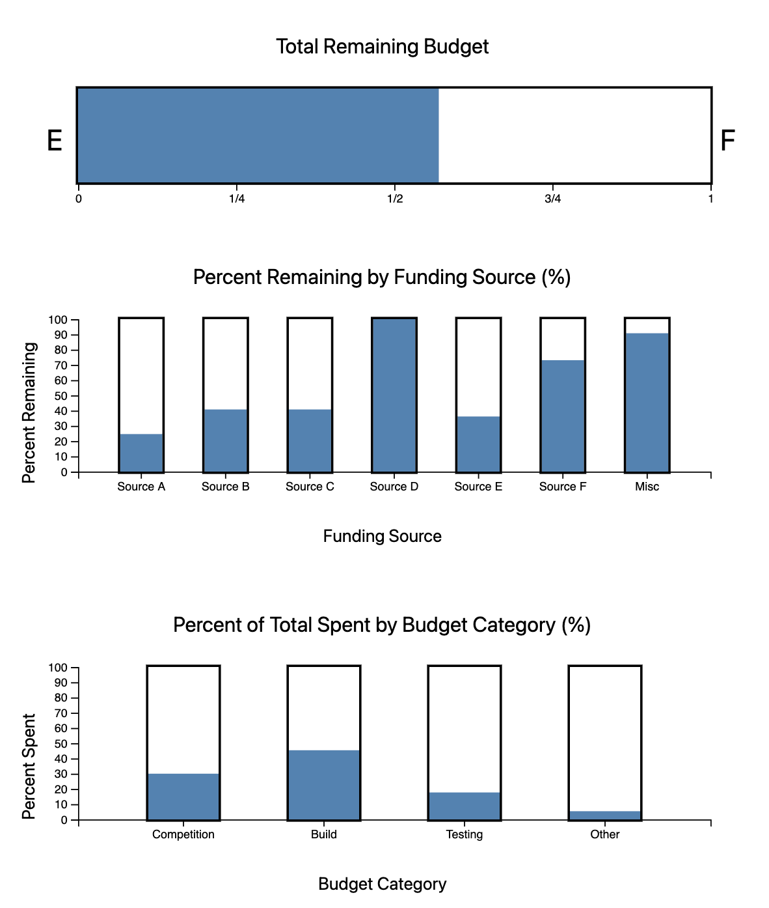

# NU Baja Budget Visualization

Service-Learning Course Project as part of
[DS 4200 F20: Information Visualization](https://canvas.instructure.com/courses/1781732), taught by
[Prof. Cody Dunne](https://cody.khoury.northeastern.edu/),
[Data Visualization @ Khoury](https://visualization.khoury.northeastern.edu/),
[Northeastern University](https://www.khoury.northeastern.edu/).

For this project, we used financial data from the Northeastern Motorsports Club to visualize a breakdown of their yearly
budget by funding sources, and also show where they are spending the most money by budget category. We used three
different bar chart variations to display a budget summary for the NU Motorsports Club. For technology, we mainly used
D3 to create our visualizations. Github
pages: [https://h0rban.github.io/nu-baja-budget-visualization/](https://h0rban.github.io/nu-baja-budget-visualization/)

**Sample**

    

**Overview and Instructions**

<iframe width="560" height="315" src="https://www.youtube.com/embed/Ff910Skuu-o" frameborder="0"
allow="accelerometer; autoplay; clipboard-write; encrypted-media; gyroscope; picture-in-picture"
allowfullscreen></iframe>

## Partners

Brandon Archbald, Shaun Khundker